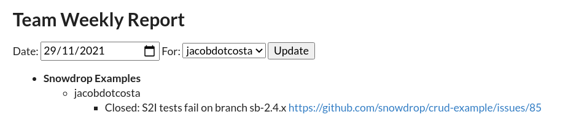

# GitHub Activity Application

This project aims at centralizing all the information about the status of Snowdrop activities in upstream.

## Running the application in dev mode

You can run your application in dev mode that enables live coding using:
```shell script
mvn compile quarkus:dev -Dactivity.token=<GITHUB TOKEN> -Dactivity.zenhub.key=<ZENHUB API KEY>
```

## Deploying to OpenShift

OpenShift secrets need to be created:
```yaml
apiVersion: v1
kind: Secret
metadata:
  name: activity-tokens
stringData:
  ACTIVITY_TOKEN=<GITHUB TOKEN>
  ACTIVITY_ZENHUB_KEY=<ZENHUB API KEY>
```

Deploy the secret using `oc create -f secret.yaml` command, update it using `oc replace -f secret.yaml` command.

Next, we deploy the application: 
```shell
mvn clean package -Dquarkus.openshift.deploy=true
```

## Snowdrop

### Team Weekly Report

This report is grouped by Users and based on Issues and Pull Requests only.

Let's see some examples:

- Pull Request without linked issue

If during the week, my user (Sgitario) created a pull request in `snowdrop/rest-http-example`, the report will display:


As the pull request is pending to be reviewed, the status is "PR submitted for review".

Note that the Pull Request is mapped to the project "Snowdrop Examples" (see more information about how pull requests and issues are mapped in the section [Projects Mapping](#projects-mapping)).

- Pull Request with linked issue

If during the week, my user (Sgitario) created a pull request in `snowdrop/circuit-breaker-example` and linked it to an existing issue, the report will display the issue instead of the pull request:


- Assigned issues

If during the week, my user (Antonio Costa) was assigned to a GitHub issue, the issue will be part of the report:



Note that if other users post a comment on the issue or any other GitHub event (like a new reference to the issue event), the issue will be part of the report as well.

### Management Weekly Report

This report is based on Tasks and Roadmap (epics). The tasks and epics should be created in the **snowdrop/team** repository.

**What is a task?** 
A task is an issue with label **task** and represents something you did during the week (example: assist a conference)
**What is a weekly task?** 
A weekly task is an issue with label **task** and **recurrent** and represents something you regularly do all the weeks (until the task is closed) (example: help Quarkus community).
**What is an epic?**
An epic is a set of issues that defines a project roadmap. We need to discuss how to define epics (see [the problem with ZenHub](#epics-in-zenhub-problem))

Let's see some examples:

- Task: Some CRI-O engineers volunteered to help me around the “buildah POC”

In order to include this task into the report, we need to create an issue in the **snowdrop/team** repository, add the label `task` and this will be reported as:


- Weekly task: I need to support the Quarkus community

If you do some recurring task that will last indefinitely, in order to avoid adding the task every week, we need to create an issue in the **snowdrop/team** repository, add the label `task` and `recurrent` and this will be reported weekly as:


- Roadmap

Roadmaps are epics that involve several tasks or other issues. For example, a Roadmap item could be **Release 2.5.x** and includes several smaller pieces to be completed:


In order to include roadmap items into the reporting, we need to create an issue in the **snowdrop/team** repository, add the label `Epic`. 
However, at the moment, we only support Epics that are created in ZenHub, however there are a lot of inconveniences using this approach (see [the problem with ZenHub](#epics-in-zenhub-problem).

Finally, the roadmap items are mapped to the project "Snowdrop Examples" (see more information about how pull requests and issues are mapped in the section [Projects Mapping](#projects-mapping)).

### Projects mapping

How to group a Pull Request or Issue under a single project? For example, the **Snowdrop Examples** is a project and all the pull requests and issues from multiple repositories like CRUD example or Secured example should be grouped in **Snowdrop Examples**. So, how can we do this? There are three ways:
1. Using regular expression to map repository names to a project (See `application.properties`, property `activity.project.map`)
2. Using labels: if a Pull Request or Issue has a label `project/XXX`, the Snowdrop reports will group the PR or Issue under the project `XXX`.
3. If none of above applies, then it will use the repository name (if a PR is for the repo github.com/snowdrop/my-repo, the project will be snowdrop/my-repo).

### Epics in ZenHub problem

Note that we can only define epics in ZenHub which brings a lot of disadvantages:
- ZenHub API is very, very slow
- We can get epic statuses to detect the epic progress, but not its issues statuses.

Alternatives should be agreed with the team, for example: Drop ZenHub and use purely GitHub to define epics. How? We could define the list of issues of an epic in the Epic description and the report will detect it and find the issues. Another way is via labels, but the label has a length size limitation.

## Useful Links

- Github Graphql Site to test your queries: `https://docs.github.com/en/graphql/overview/explorer`
- Public Graphql Schema: https://docs.github.com/en/graphql/overview/public-schema
- ZenHub API: `curl -H 'Content-Type: application/json' -H 'X-Authentication-Token: <API TOKEN>' https://api.zenhub.com/p1/repositories/259889605/epics/602`